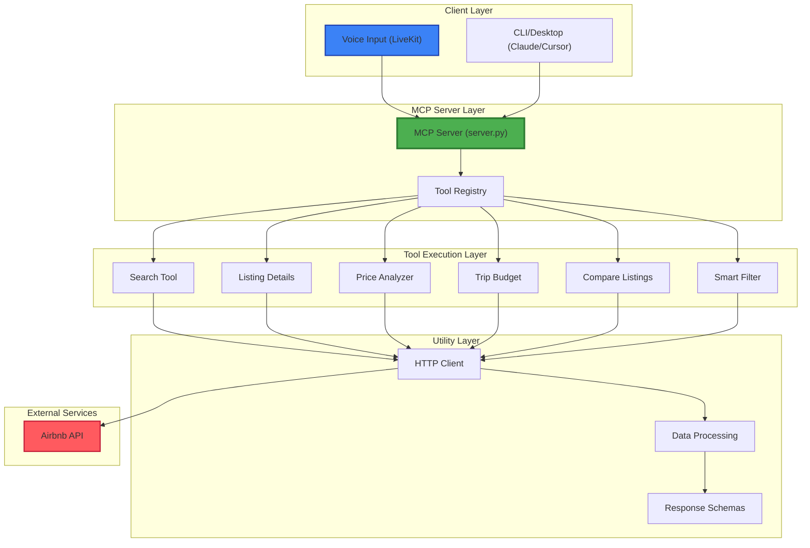
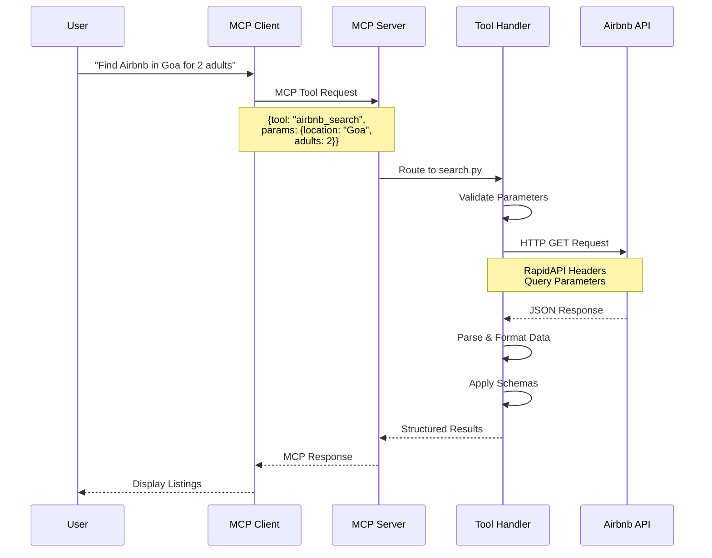
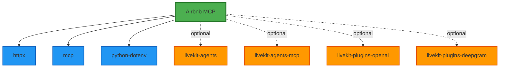

# Airbnb MCP Server - Complete Documentation

## 📋 Table of Contents
- [Overview](#overview)
- [Architecture](#architecture)
- [Tool Call Workflow](#tool-call-workflow)
- [Voice Command Examples](#voice-command-examples)
- [MCP Server Setup](#mcp-server-setup)
- [Available Tools](#available-tools)
- [Dependencies](#dependencies)

---

## 🎯 Overview

The Airbnb MCP Server is a Model Context Protocol (MCP) server that provides AI assistants with the ability to search and analyze Airbnb listings through natural language and voice commands. It integrates with LiveKit for voice interactions and supports both HTTP and STDIO communication protocols.

### Key Features
- 🔍 Advanced Airbnb listing search
- 💰 Price analysis across date ranges
- 📊 Trip budget calculations
- 🔄 Listing comparisons
- 🎤 Voice-enabled interactions via LiveKit
- 🛠️ Multiple MCP client support (Claude Desktop, Cursor, etc.)

---

## 🏗️ Architecture



### Component Overview

#### 1. **MCP Server Core** (`server.py`)
- Handles MCP protocol communication
- Registers and manages available tools
- Routes requests to appropriate tool handlers
- Manages error handling and logging

#### 2. **Tool Layer**
Individual tools that handle specific Airbnb operations:
- `search.py` - Basic listing search
- `listing_details.py` - Detailed property information
- `price_analyzer.py` - Multi-date price comparison
- `trip_budget.py` - Budget calculations with fees
- `compare_listings.py` - Side-by-side comparisons
- `smart_filter.py` - Advanced filtering and sorting

#### 3. **Utility Layer**
- `http_client.py` - HTTP request handling
- `data_processing.py` - Response parsing and formatting
- `schemas.py` - Pydantic data models

#### 4. **Integration Layer**
- LiveKit agents for voice interaction
- MCP client configurations (Claude, Cursor)

---

## 🔄 Tool Call Workflow



### Detailed Workflow Steps

1. **User Input Processing**
   - Natural language or voice command received
   - Client (Claude/Cursor/LiveKit) interprets intent
   - Extracts parameters (location, dates, guests)

2. **MCP Request Formation**
   ```json
   {
     "method": "tools/call",
     "params": {
       "name": "airbnb_search",
       "arguments": {
         "location": "Goa, India",
         "adults": 2,
         "checkin": "2025-12-20",
         "checkout": "2025-12-27"
       }
     }
   }
   ```

3. **Server-Side Processing**
   - Server validates tool exists
   - Routes to appropriate tool handler
   - Tool validates parameters against schema

4. **API Interaction**
   ```python
   # Example from search.py
   headers = {
       "X-RapidAPI-Key": RAPIDAPI_KEY,
       "X-RapidAPI-Host": "airbnb19.p.rapidapi.com"
   }
   
   params = {
       "query": location,
       "adults": adults,
       "checkin": checkin,
       "checkout": checkout
   }
   
   response = http_client.get(url, headers=headers, params=params)
   ```

5. **Response Processing**
   - Parse JSON response
   - Apply data transformations
   - Format using Pydantic schemas
   - Return structured data

6. **Client Presentation**
   - Client receives structured response
   - Formats for user (text, voice, or UI)
   - Handles errors gracefully

---

## 🎤 Voice Command Examples

### Basic Search Commands

```
User: "Hey, find me some Airbnbs in Goa for next month"
Agent: [Calls airbnb_search]
       "I found 15 listings in Goa. Here are the top options..."

User: "Show me cheaper options under 5000 rupees per night"
Agent: [Calls airbnb_smart_filter with max_price=5000]
       "I've filtered to 8 listings under ₹5,000 per night..."

User: "What about the one near the beach?"
Agent: [Uses context from previous search]
       "Let me get details on that beachfront villa..."
```

### Price Analysis Commands

```
User: "Compare prices for Goa between Christmas week and New Year"
Agent: [Calls airbnb_price_analyzer]
       "Christmas week (Dec 23-30) averages ₹8,500/night,
        while New Year week (Dec 30-Jan 6) averages ₹12,000/night.
        You'd save ₹24,500 by choosing Christmas week!"

User: "When's the cheapest time to visit in the next 3 months?"
Agent: [Calls airbnb_price_analyzer with multiple date ranges]
       "Based on my analysis, late January shows the lowest prices..."
```

### Budget Planning Commands

```
User: "What's the total cost for that villa for 4 people for a week?"
Agent: [Calls airbnb_trip_budget]
       "For 7 nights at ₹6,000/night:
        - Accommodation: ₹42,000
        - Service fee: ₹6,300
        - Taxes: ₹2,520
        Total: ₹50,820 (₹12,705 per person)"

User: "Include cleaning fees in that"
Agent: [Accesses detailed pricing breakdown]
       "With the ₹2,000 cleaning fee, total is ₹52,820..."
```

### Comparison Commands

```
User: "Compare the villa and the apartment we looked at"
Agent: [Calls airbnb_compare_listings]
       "Villa:
        - Price: ₹8,000/night, 3 bedrooms
        - Rating: 4.8, Pool, Kitchen
        
        Apartment:
        - Price: ₹4,500/night, 2 bedrooms
        - Rating: 4.6, Kitchen, No pool
        
        The villa offers better value for groups..."

User: "Which one has better reviews?"
Agent: [Analyzes rating data]
       "The villa has a 4.8 rating from 127 reviews..."
```

### Advanced Filter Commands

```
User: "Find highly rated places with a pool, sorted by best value"
Agent: [Calls airbnb_smart_filter]
       "Filtering for 4.5+ rating, pool amenity, sorted by value..."

User: "Show me only superhosts with instant booking"
Agent: [Applies multiple filters]
       "Found 6 superhosts with instant booking available..."
```

---

## ⚙️ MCP Server Setup

### Prerequisites
- Python 3.10 or higher
- Git
- RapidAPI Key for Airbnb API

### Setup Option 1: MCP Server Only (Recommended)

This option sets up only the MCP server for use with Claude Desktop, Cursor, or other MCP clients.

#### Step 1: Clone Repository
```bash
git clone https://github.com/vedantparmar12/airbnb-mcp.git
cd airbnb-mcp
```

#### Step 2: Create Virtual Environment

**For Windows:**
```bash
cd mcp-server-airbnb
python -m venv venv
venv\Scripts\activate
```

**For macOS/Linux:**
```bash
cd mcp-server-airbnb
python3 -m venv venv
source venv/bin/activate
```

#### Step 3: Install Dependencies
```bash
pip install -r requirements.txt
```

#### Step 4: Configure Environment
Create `.env` file in `mcp-server-airbnb` directory:
```env
RAPIDAPI_KEY=your_rapidapi_key_here
```

Get your RapidAPI key:
1. Visit https://rapidapi.com/DataCrawler/api/airbnb19
2. Sign up/Login
3. Subscribe to free tier
4. Copy your API key

#### Step 5: Test the Server
```bash
python server.py
```

You should see:
```
MCP Server running on stdio transport
Registered 6 tools
```

---

### Setup Option 2: Full Setup (MCP Server + Voice Agent)

This option includes both the MCP server and LiveKit voice integration.

#### Step 1: Clone and Create Virtual Environments

**Windows:**
```bash
git clone https://github.com/vedantparmar12/airbnb-mcp.git
cd airbnb-mcp

# Create venv for MCP server
cd mcp-server-airbnb
python -m venv venv_mcp
venv_mcp\Scripts\activate
pip install -r requirements.txt
deactivate

# Create venv for voice agent
cd ..
python -m venv venv_voice
venv_voice\Scripts\activate
pip install -r requirements.txt
```

**macOS/Linux:**
```bash
git clone https://github.com/vedantparmar12/airbnb-mcp.git
cd airbnb-mcp

# Create venv for MCP server
cd mcp-server-airbnb
python3 -m venv venv_mcp
source venv_mcp/bin/activate
pip install -r requirements.txt
deactivate

# Create venv for voice agent
cd ..
python3 -m venv venv_voice
source venv_voice/bin/activate
pip install -r requirements.txt
```

#### Step 2: Configure Environment Variables

Create `.env` in root directory:
```env
# API Keys
RAPIDAPI_KEY=your_rapidapi_key_here
OPENAI_API_KEY=your_openai_key_here

# LiveKit Configuration
LIVEKIT_URL=your_livekit_url
LIVEKIT_API_KEY=your_livekit_api_key
LIVEKIT_API_SECRET=your_livekit_api_secret

# Deepgram (for voice)
DEEPGRAM_API_KEY=your_deepgram_key
```

#### Step 3: Configure MCP Server Path

**For Windows:**
Update `livekit_mcp_agent.py` line ~50:
```python
server = MCPServer(
    "airbnb",
    "path/to/airbnb-mcp/mcp-server-airbnb/venv_mcp/Scripts/python.exe",
    "path/to/airbnb-mcp/mcp-server-airbnb/server.py",
    env={"RAPIDAPI_KEY": rapidapi_key}
)
```

**For macOS/Linux:**
```python
server = MCPServer(
    "airbnb",
    "path/to/airbnb-mcp/mcp-server-airbnb/venv_mcp/bin/python",
    "path/to/airbnb-mcp/mcp-server-airbnb/server.py",
    env={"RAPIDAPI_KEY": rapidapi_key}
)
```

#### Step 4: Run Voice Agent
```bash
# Activate voice environment
source venv_voice/bin/activate  # Linux/Mac
# or
venv_voice\Scripts\activate  # Windows

# Run agent
python livekit_mcp_agent.py start
```

---

### Configure MCP Clients

#### Claude Desktop Configuration

Edit `claude_desktop_config.json`:

**Windows:**
```json
{
  "mcpServers": {
    "airbnb": {
      "command": "C:\\Users\\YourUser\\path\\to\\airbnb-mcp\\mcp-server-airbnb\\venv\\Scripts\\python.exe",
      "args": [
        "C:\\Users\\YourUser\\path\\to\\airbnb-mcp\\mcp-server-airbnb\\server.py"
      ],
      "env": {
        "RAPIDAPI_KEY": "your_rapidapi_key_here"
      }
    }
  }
}
```

**macOS/Linux:**
```json
{
  "mcpServers": {
    "airbnb": {
      "command": "/Users/youruser/path/to/airbnb-mcp/mcp-server-airbnb/venv/bin/python",
      "args": [
        "/Users/youruser/path/to/airbnb-mcp/mcp-server-airbnb/server.py"
      ],
      "env": {
        "RAPIDAPI_KEY": "your_rapidapi_key_here"
      }
    }
  }
}
```

#### Cursor Configuration

Add to Cursor's MCP settings (`.cursor/mcp_config.json`):
```json
{
  "mcpServers": {
    "airbnb": {
      "command": "/absolute/path/to/venv/bin/python",
      "args": ["/absolute/path/to/server.py"],
      "env": {
        "RAPIDAPI_KEY": "your_key_here"
      }
    }
  }
}
```

---

## 🛠️ Available Tools

### 1. `airbnb_search`
Basic search for Airbnb listings.

**Parameters:**
- `location` (required): Location to search
- `adults` (optional): Number of adults (default: 1)
- `children` (optional): Number of children (default: 0)
- `checkin` (optional): Check-in date (YYYY-MM-DD)
- `checkout` (optional): Check-out date (YYYY-MM-DD)
- `limit` (optional): Number of results (default: 10)

**Example:**
```json
{
  "location": "Goa, India",
  "adults": 2,
  "checkin": "2025-12-20",
  "checkout": "2025-12-27"
}
```

### 2. `airbnb_listing_details`
Get detailed information about a specific listing.

**Parameters:**
- `id` (required): Airbnb listing ID
- `adults`, `children`, `checkin`, `checkout` (optional)

### 3. `airbnb_price_analyzer`
Compare prices across different date ranges.

**Parameters:**
- `location` (required): Location to search
- `date_ranges` (required): List of {checkin, checkout} pairs
- `adults`, `children` (optional)

**Example:**
```json
{
  "location": "Goa, India",
  "date_ranges": [
    {"checkin": "2025-12-23", "checkout": "2025-12-30"},
    {"checkin": "2025-12-30", "checkout": "2026-01-06"}
  ]
}
```

### 4. `airbnb_trip_budget`
Calculate total trip cost with all fees.

**Parameters:**
- `listing_id` (required): Listing ID
- `checkin`, `checkout` (required): Date range
- `adults`, `children` (optional)
- `currency` (optional): Currency code (default: INR)

### 5. `airbnb_compare_listings`
Compare 2-5 listings side-by-side.

**Parameters:**
- `listing_ids` (required): Array of 2-5 listing IDs
- Date and guest parameters (optional)

### 6. `airbnb_smart_filter`
Advanced search with filters and sorting.

**Parameters:**
- `location` (required)
- `min_price`, `max_price` (optional): Price range
- `min_rating` (optional): Minimum rating (e.g., 4.5)
- `sort_by` (optional): "price", "rating", or "value"
- Standard search parameters

---

## 📦 Dependencies

### Core Dependencies
```
httpx>=0.24.0
mcp>=0.9.0
python-dotenv>=1.0.0
```

### Voice Agent Dependencies (Optional)
```
livekit-agents
livekit-agents[mcp]
livekit-plugins-openai
livekit-plugins-deepgram
livekit-plugins-silero
livekit-plugins-turn-detector
```

### Dependency Graph



---

## 🔧 Troubleshooting

### Common Issues

1. **Import Error: mcp module not found**
   ```bash
   pip install --upgrade mcp
   ```

2. **RapidAPI Rate Limit**
   - Free tier: 50 requests/month
   - Upgrade plan or wait for reset

3. **Wrong Python Path in Config**
   - Use absolute paths
   - Verify with: `which python` (Linux/Mac) or `where python` (Windows)

4. **LiveKit Connection Issues**
   - Check environment variables
   - Verify LiveKit server is running
   - Confirm API keys are correct

---

## 📝 License

This project is provided as-is for educational and development purposes.

---

## 🤝 Contributing

Contributions are welcome! Please:
1. Fork the repository
2. Create a feature branch
3. Make your changes
4. Submit a pull request

---

## 📧 Support

For issues and questions:
- GitHub Issues: https://github.com/vedantparmar12/airbnb-mcp/issues
- RapidAPI Support: https://rapidapi.com/support

---

**Built with ❤️ using Model Context Protocol (MCP)**
