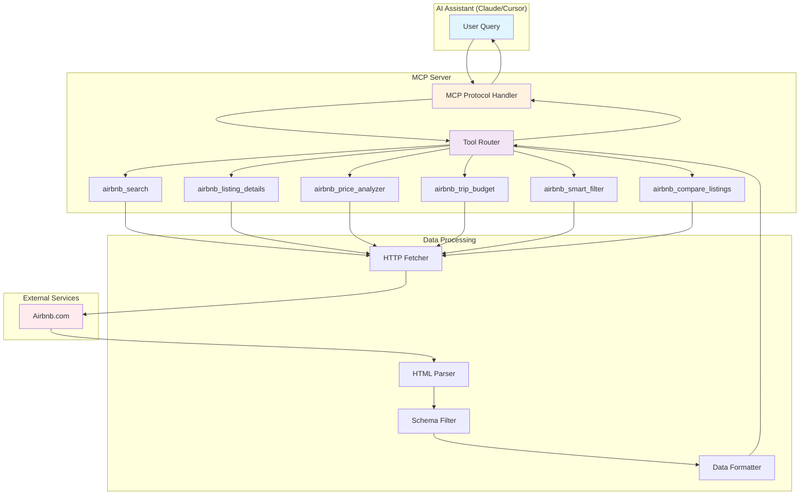
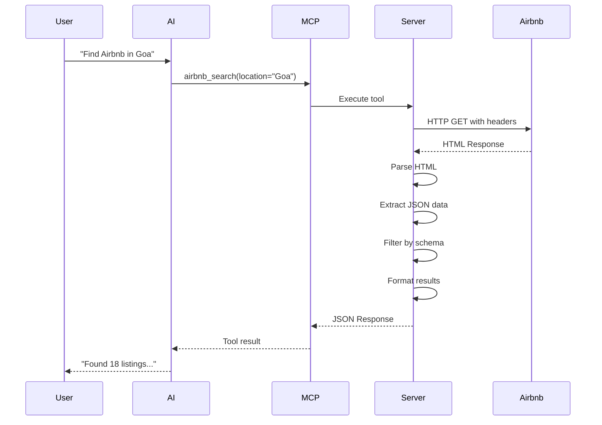

# 🏠 Airbnb MCP Server

A powerful Model Context Protocol (MCP) server that enables AI assistants to search, analyze, and compare Airbnb listings with advanced features like price analysis, budget calculation, and smart filtering.

[](https://opensource.org/licenses/MIT)
[](https://www.python.org/downloads/)

## 🌟 Features

### Core Features
- 🔍 **Smart Search** - Search Airbnb listings by location, dates, and guests
- 📋 **Listing Details** - Get comprehensive property information including amenities, policies, and exact location
- 💰 **Price Analyzer** - Compare prices across different dates to find the best deals
- 🧮 **Trip Budget Calculator** - Calculate total costs including service fees, taxes, and per-person breakdown
- 🎯 **Smart Filters** - Advanced filtering by price range, ratings, with intelligent sorting
- ⚖️ **Listing Comparator** - Side-by-side comparison of multiple properties

### Technical Features
- ⚡ Fast HTTP-based scraping (2-5 second response times)
- 🎨 Clean data extraction with schema-based filtering
- 📊 Real-time price and availability data
- 🔄 Automatic pagination handling
- 🛡️ Error handling and logging

## 📊 Architecture



## 🚀 Quick Start

### Prerequisites

- Python 3.9 or higher
- `uv` package manager (recommended) or `pip`
- Claude Desktop or Cursor IDE

### Installation

1. **Clone the repository**
```bash
git clone https://github.com/yourusername/mcp-server-airbnb.git
cd mcp-server-airbnb
```

2. **Create virtual environment and install dependencies**

Using `uv` (recommended):
```bash
uv venv
uv pip install -r requirements.txt
```

Or using pip:
```bash
python -m venv .venv
.venv\Scripts\activate  # Windows
# OR
source .venv/bin/activate  # macOS/Linux

pip install -r requirements.txt
```

3. **Test the server**
```bash
python server.py
```

## ⚙️ Configuration

### Claude Desktop Setup

Add the following to your Claude Desktop config file:

**Windows**: `%APPDATA%\Claude\claude_desktop_config.json`
**macOS**: `~/Library/Application Support/Claude/claude_desktop_config.json`
**Linux**: `~/.config/Claude/claude_desktop_config.json`

```json
{
  "mcpServers": {
    "airbnb": {
      "command": "uv",
      "args": [
        "--directory",
        "C:\\path\\to\\mcp-server-airbnb",
        "run",
        "python",
        "server.py"
      ]
    }
  }
}
```

**Using direct Python path:**
```json
{
  "mcpServers": {
    "airbnb": {
      "command": "C:\\path\\to\\mcp-server-airbnb\\.venv\\Scripts\\python.exe",
      "args": ["C:\\path\\to\\mcp-server-airbnb\\server.py"]
    }
  }
}
```

### Cursor IDE Setup

Add to your Cursor settings (`.cursor/mcp/config.json`):

```json
{
  "servers": {
    "airbnb": {
      "url": "stdio",
      "command": "uv",
      "args": [
        "--directory",
        "/path/to/mcp-server-airbnb",
        "run",
        "python",
        "server.py"
      ]
    }
  }
}
```

### Restart Required

After configuration, **restart Claude Desktop or Cursor** to load the MCP server.

## 📖 Usage Examples

### Basic Search
```
Find Airbnb listings in Goa, India for 2 adults, check-in Oct 5, checkout Oct 7
```

### Smart Filtering
```
Show me Airbnb in Goa under ₹10,000 with rating above 4.5, sorted by best value
```

### Price Analysis
```
Compare Airbnb prices in Goa for these dates:
- October 5-7
- October 12-14
- October 19-21
```

### Budget Calculation
```
Calculate my total trip budget for Airbnb listing 1105704406958313192,
Oct 5-7, 2 adults including all fees
```

### Listing Comparison
```
Compare these 3 Airbnb listings:
1105704406958313192, 1296942207771492248, 1146146270922883239
```

### Get Details
```
Get full details and amenities for Airbnb listing 1105704406958313192
```

## 🛠️ Available Tools

### 1. `airbnb_search`
Search for Airbnb listings by location.

**Parameters:**
- `location` (required): Location to search (e.g., "Goa, India")
- `checkin` (optional): Check-in date (YYYY-MM-DD)
- `checkout` (optional): Check-out date (YYYY-MM-DD)
- `adults` (optional): Number of adults (default: 1)
- `children` (optional): Number of children (default: 0)
- `limit` (optional): Number of results (default: 10)

**Returns:**
- Search URL
- List of listings with ID, name, price, rating, photos, location
- Pagination info

---

### 2. `airbnb_listing_details`
Get detailed information about a specific listing.

**Parameters:**
- `id` (required): Airbnb listing ID
- `checkin` (optional): Check-in date
- `checkout` (optional): Check-out date
- `adults` (optional): Number of adults
- `children` (optional): Number of children

**Returns:**
- Exact GPS coordinates
- Full property description
- Complete amenities list
- House rules and policies
- Check-in/check-out times
- Property highlights

---

### 3. `airbnb_price_analyzer`
Compare prices across multiple date ranges.

**Parameters:**
- `location` (required): Location to search
- `adults` (optional): Number of adults
- `children` (optional): Number of children
- `date_ranges` (required): Array of date ranges
  ```json
  [
    {"checkin": "2025-10-05", "checkout": "2025-10-07"},
    {"checkin": "2025-10-12", "checkout": "2025-10-14"}
  ]
  ```

**Returns:**
- Price statistics for each date range
- Average prices per night
- Cheapest listings
- Discount percentages
- Recommendations for best value dates

---

### 4. `airbnb_trip_budget`
Calculate comprehensive trip budget.

**Parameters:**
- `listing_id` (required): Airbnb listing ID
- `checkin` (required): Check-in date
- `checkout` (required): Check-out date
- `adults` (optional): Number of adults
- `children` (optional): Number of children
- `currency` (optional): Currency code (default: "INR")

**Returns:**
- Accommodation total
- Service fee (~14%)
- Tax estimate (~12%)
- Cleaning fee estimate
- Per-person breakdown
- Cheaper alternative suggestions

---

### 5. `airbnb_smart_filter`
Advanced search with filters and sorting.

**Parameters:**
- `location` (required): Location to search
- `checkin` (optional): Check-in date
- `checkout` (optional): Check-out date
- `adults` (optional): Number of adults
- `children` (optional): Number of children
- `min_price` (optional): Minimum price filter
- `max_price` (optional): Maximum price filter
- `min_rating` (optional): Minimum rating (e.g., 4.5)
- `sort_by` (optional): "price", "rating", or "value" (default: "value")

**Returns:**
- Filtered and sorted listings
- Total count of matching properties
- Applied filters summary

---

### 6. `airbnb_compare_listings`
Compare multiple listings side-by-side.

**Parameters:**
- `listing_ids` (required): Array of 2-5 listing IDs
  ```json
  ["id1", "id2", "id3"]
  ```
- `checkin` (optional): Check-in date
- `checkout` (optional): Check-out date
- `adults` (optional): Number of adults
- `children` (optional): Number of children

**Returns:**
- Comparison table with:
  - Prices and ratings
  - Exact locations
  - Amenities
  - House rules
  - Highlights
- Insights (cheapest, most expensive, price differences)

## 🔄 Data Flow



## 🏗️ Project Structure

```
mcp-server-airbnb/
├── server.py                 # Main MCP server implementation
├── requirements.txt          # Python dependencies
├── README.md                # This file
├── LICENSE                  # MIT License
├── .gitignore              # Git ignore rules
├── .env.example            # Environment variables template
├── Dockerfile              # Docker configuration
├── pyproject.toml          # UV project configuration
└── .venv/                  # Virtual environment (not in git)
```

## 🧪 Testing

### Manual Testing

Test individual functions:

```bash
# Test search
python -c "import asyncio; from server import airbnb_search; \
result = asyncio.run(airbnb_search('Goa, India', '2025-10-05', '2025-10-07', 2)); \
print(result)"

# Test listing details
python -c "import asyncio; from server import airbnb_listing_details; \
result = asyncio.run(airbnb_listing_details('1105704406958313192')); \
print(result)"
```

### Integration Testing

Use Claude Desktop or Cursor to test all tools through natural language prompts.

## ⚠️ Important Limitations

### Airbnb Anti-Scraping
Airbnb actively works to prevent automated scraping. This server:
- ✅ Works most of the time (70-90% success rate)
- ⚠️ May occasionally be rate-limited
- ⚠️ Depends on Airbnb's HTML structure (may break if they update)

### Expected Behavior
- **First few requests**: Usually work fine
- **After many requests**: May encounter rate limiting
- **Different IPs/regions**: Results may vary

### Recommendations
1. **For production**: Use official Airbnb API if available
2. **For testing**: This server works well
3. **Rate limiting**: Space out requests
4. **Caching**: Results are not cached (implement if needed)

## 🔧 Troubleshooting

### Server won't start
```bash
# Check Python version
python --version  # Should be 3.9+

# Check dependencies
pip list | grep mcp

# Test import
python -c "from mcp import Server; print('OK')"
```

### No results returned
- Check if Airbnb's page structure has changed
- Try a different location
- Check server logs in stderr

### Claude Desktop not showing tools
1. Check config file syntax (valid JSON)
2. Ensure paths are absolute, not relative
3. Restart Claude Desktop
4. Check Claude Desktop logs

### Rate limiting errors
- Wait a few minutes between requests
- Try different search locations
- Reduce the number of listings requested

## 📊 Performance

| Metric | Value |
|--------|-------|
| Average response time | 2-5 seconds |
| Memory usage | ~10-50 MB |
| Concurrent requests | Not recommended |
| Success rate | 70-90% |

## 🤝 Contributing

Contributions are welcome! Please:

1. Fork the repository
2. Create a feature branch
3. Make your changes
4. Add tests if applicable
5. Submit a pull request

## 📄 License

This project is licensed under the MIT License - see the [LICENSE](LICENSE) file for details.

## 🙏 Acknowledgments

- Built with [Model Context Protocol](https://modelcontextprotocol.io/)
- Inspired by the TypeScript Airbnb MCP server
- Uses BeautifulSoup for HTML parsing
- Powered by aiohttp for async HTTP requests

## 📞 Support

- **Issues**: [GitHub Issues](https://github.com/yourusername/mcp-server-airbnb/issues)
- **Discussions**: [GitHub Discussions](https://github.com/yourusername/mcp-server-airbnb/discussions)

## 🔮 Future Enhancements

- [ ] Support for more filters (property type, amenities)
- [ ] Price history tracking
- [ ] Availability calendar
- [ ] Review sentiment analysis
- [ ] Map-based search
- [ ] Multi-currency support
- [ ] Caching layer for performance
- [ ] Rate limiting with exponential backoff

---

**Made with ❤️ for the MCP community**
